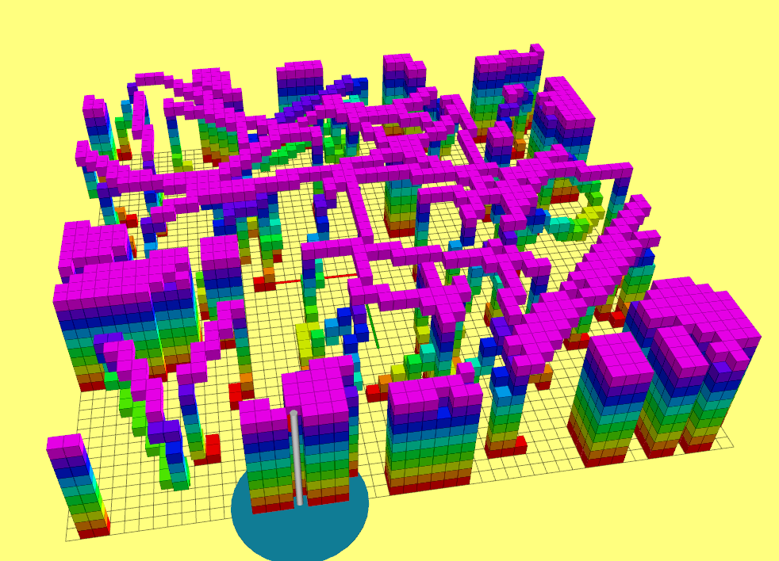
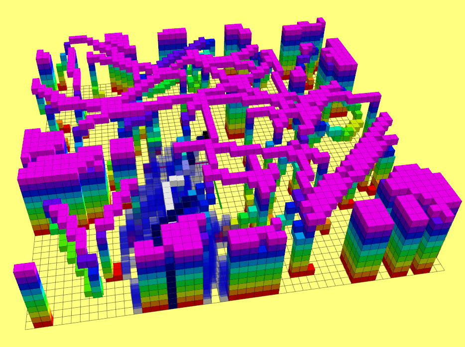
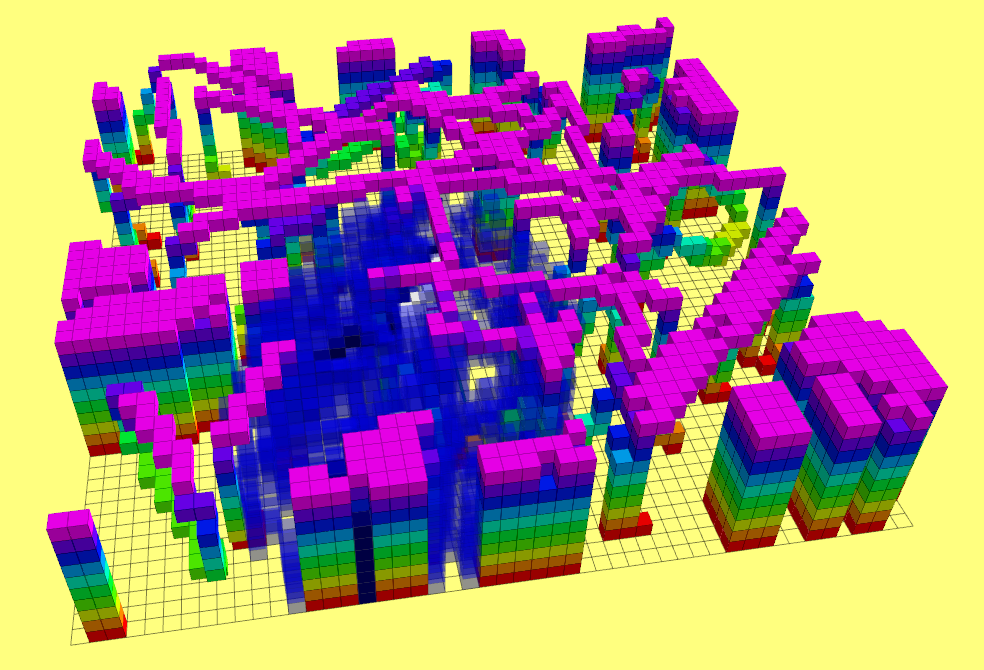
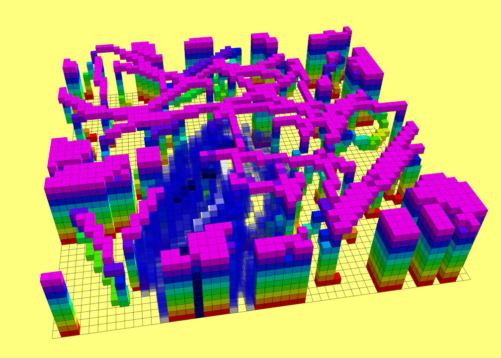
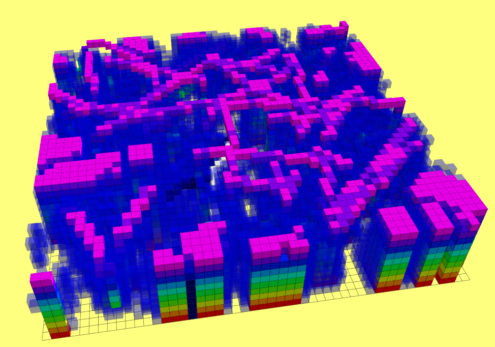

## 1. 代码运行方法

编译

```shell
cd {workspace}
catkin_make  -j12
```

运行

```shell	
cd {workspace}
source devel/setup.bash
roslaunch grid_path_searcher demo.launch

# 更换启发函数 Manhattan, Euclidean, Diagonal, Dijkstra
rosparam set /demo_node/heuristic_type Manhattan #通过参数服务器，避免重启程序地图发生变化

# 打开或者关闭Tie Breaker   true: 打开  false: 关闭
rosparam set /demo_node/use_tie_breaker true
```

> 默认启动的情况下，A star和JPS均使用启发函数`Diagonal`和使用`Tie breaker`

## 2. 实验结果

### a. 启发函数对比

__Map__



> 坐标系原点为起点(地图中心)，红旗的杆底是终点

__启发函数：Manhattan__



> A star – 用时：26.98 ms       遍历节点数量：1727      轨迹长度：7.15 m
>
> JPS -   用时：1.55 ms       遍历节点数量：525      轨迹长度：7.02 m

__启发函数：Euclidean__



> A star – 用时：31.2 ms       遍历节点数量：3669      轨迹长度：6.67 m
>
> JPS -   用时：3.02 ms       遍历节点数量：1024      轨迹长度：6.67 m

__启发函数：Diagonal__ 



> A star – 用时：39.2 ms       遍历节点数量：4357      轨迹长度：7.02 m
>
> JPS -   用时：4.21 ms       遍历节点数量：1421     轨迹长度：7.02 m

__启发函数：Dijkstra__ 



>  A star – 用时：136.5 ms       遍历节点数量：21208      轨迹长度：7.02 m
>
>  JPS -   用时：32.13 ms       遍历节点数量：10304     轨迹长度：7.02 m

__结论： __在此种场景下A star使用Manhattan启发函数，效率最高，遍历的节点数也最少。在地图范围只有10x10x2的情况下，做了少量的实验发现，启发函数的速度大致为：Manhattan > Diagonal > Euclidean >> Dijkstra. 该结论不一定适合所有场景，在具体使用场景下具体对比，才能获得更加可靠的结果。

多数情况下，JPS的速度都明显优于A star，但是某些情况下A star效果更快，例如环境中障碍物特别多，并且JPS算法检测到了很多Jump Point，此时可能出现JPS速度比A star慢。另外在小范围(1~3m)内，如果障碍物较少，此时由于JPS算法检测Jump Point比较耗时，可能出现A star速度更快。

### b. Tie breaker 对比

__No Tie Breaker__

Manhattan

> A star – 用时：16.6 ms       遍历节点数量：1779      轨迹长度：7.15 m
>
> JPS -   用时：1.36 ms       遍历节点数量：513     轨迹长度：7.02 m

Euclidean

>A star – 用时：37.6 ms       遍历节点数量：4411      轨迹长度：7.02 m
>
>JPS -   用时：4.36 ms       遍历节点数量：1429     轨迹长度：7.02 m

Diagonal

>A star – 用时：38.97 ms       遍历节点数量：3747      轨迹长度：7.02 m
>
>JPS -   用时：3.77 ms       遍历节点数量：1086     轨迹长度：7.02 m

__Have Tie Breaker__

Manhattan

> A star – 用时：26.98 ms       遍历节点数量：1727      轨迹长度：7.15 m
>
> JPS -   用时：1.55 ms       遍历节点数量：525      轨迹长度：7.02 m

Euclidean

>A star – 用时：31.2 ms       遍历节点数量：3669      轨迹长度：6.67 m
>
>JPS -   用时：3.02 ms       遍历节点数量：1024      轨迹长度：6.67 m

Diagonal

>A star – 用时：39.2 ms       遍历节点数量：4357      轨迹长度：7.02 m
>
>JPS -   用时：4.21 ms       遍历节点数量：1421     轨迹长度：7.02 m

__结论：__实验发现加入Tie Breaker对于A star和JPS的提高有限，不同的启发函数可能得到的效果也不一致，有时会提升有时候会导致算法效率下降。由于我没有对Tie Breaker的参数进行深入调试，当然这也是Tie Breaker的问题，一旦深入调参就会进入局部最优解，场景的扩展性就会下降，所以对于Tie Breaker的使用需要根据实际情况进行调整。

## 3. 总结

__对于栅格地图，绝多数情况下应该优先选择JPS。__
