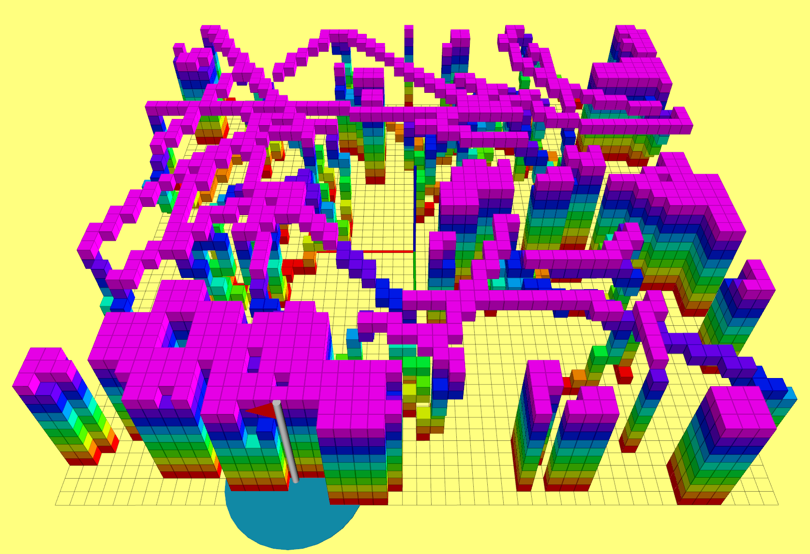
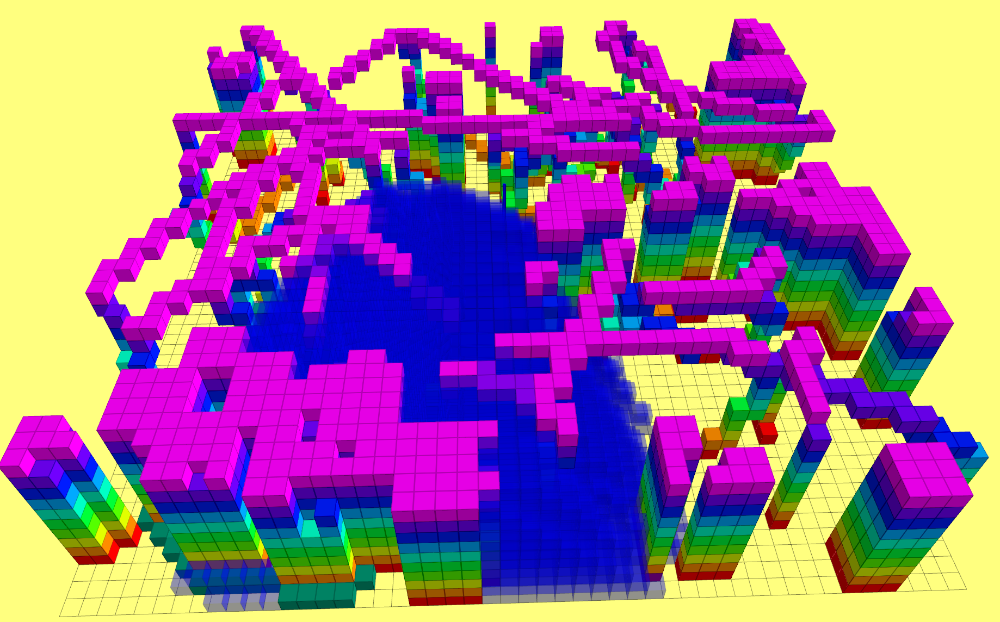
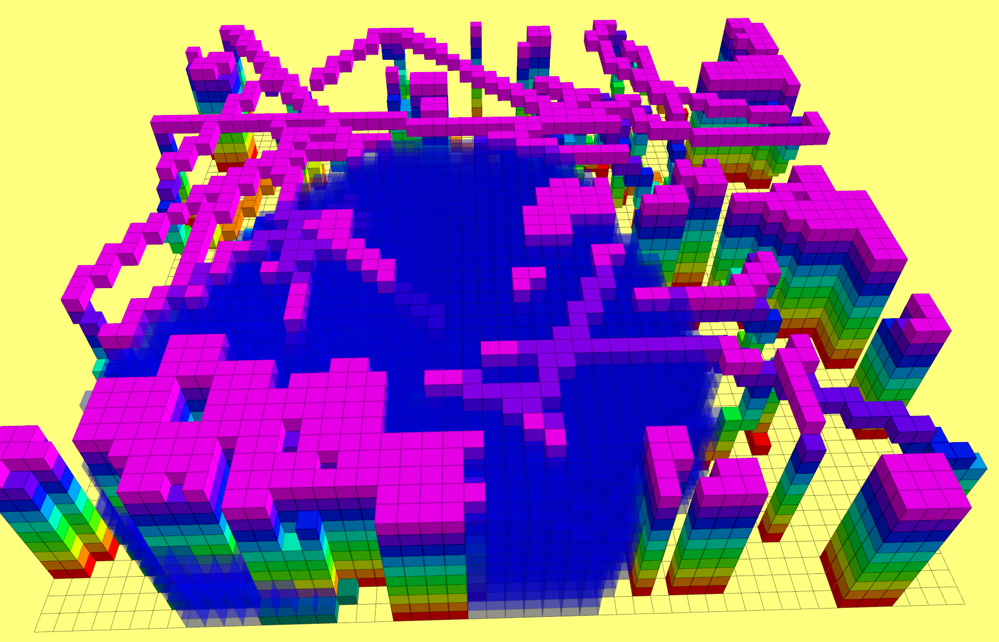
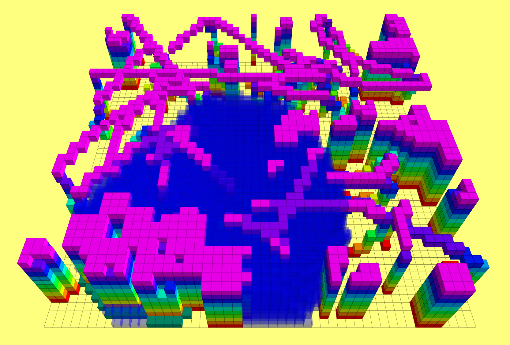
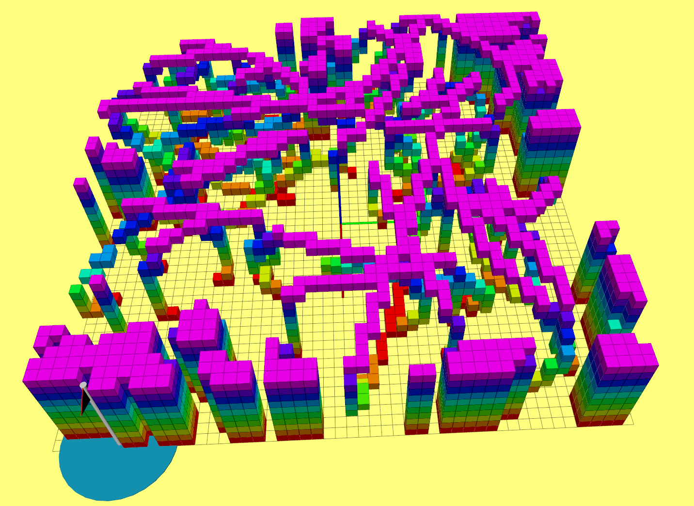
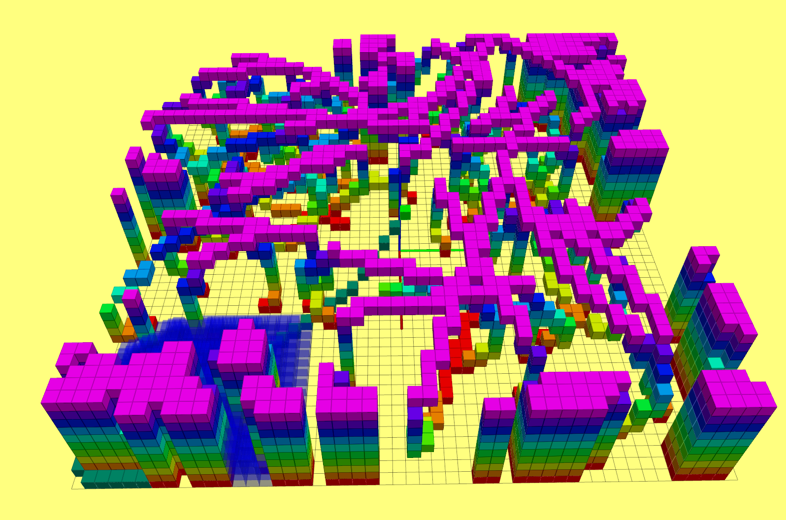
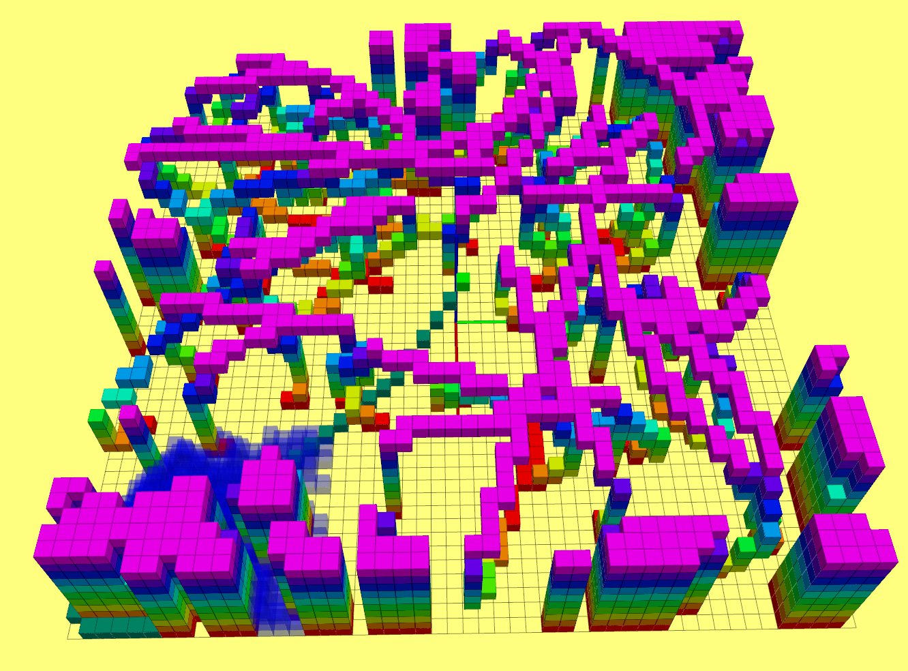

## 代码运行方法

编译

```shell
catkin_make -j12
```

运行

```shell	
# 务必按照顺序执行
#打开一个终端
cd {workspace}
source devel/setup.bash
roscore

#打开一个新终端
cd {workspace}
source devel/setup.bash
rviz #加载grid_path_searcher/launch/rviz_config/demo.rviz

#打开一个新终端
cd {workspace}
source devel/setup.bash
roslaunch grid_path_searcher demo.launch

# 更换启发函数 Manhattan, Euclidean, Diagonal, Dijkstra
rosparam set /demo_node/heuristic_type Manhattan

# 打开或者关闭Tie Breaker   true: 打开  false: 关闭
rosparam set /demo_node/use_tie_breaker true
```

## A* 算法路径搜索实验结果

### a. 启发函数对比

__Map__



> 坐标系原点为起点，红旗处为终点

__启发函数：Manhattan__



> 用时：5.131498 ms       遍历节点数量：3850      轨迹长度：7.4 m

__启发函数：Euclidean__



> 用时：5.587358 ms       遍历节点数量：6061      轨迹长度：7.4 m

__启发函数：Diagonal__ 



> 用时：6.736582 ms       遍历节点数量：5423      轨迹长度：7.4 m

__启发函数：Dijkstra__ 


>  用时：13.358894 ms       遍历节点数量：20743      轨迹长度：7.4 m

__结论： __在此种场景下Manhattan启发函数，效率最高，遍历的节点数也最少。Diagonal启发函数比Euclidean启发函数遍历的节点更少，但是它的用时却高一些，其主要原因是它的启发函数计算过程明显比Euclidean复杂。在地图范围只有10x10x2的情况下，做了少量的实验发现，启发函数的速度大致为：Manhattan > Diagonal > Euclidean. 该结论不一定适合所有场景，在具体使用场景下具体对比，才能获得更加可靠的结果。

### b. Tie breaker 对比

__Map__



__No Tie Breaker__



> 用时：0.973618 ms       遍历节点数量：586      轨迹长度：6.8 m

__Have Tie Breaker__



> 用时：0.471131 ms       遍历节点数量：386      轨迹长度：6.8 m

__结论：__实验发现加入Tie Breaker可以大幅度提高A星搜索算法的效率，打破路径的对称性，减少路径搜索的震荡。