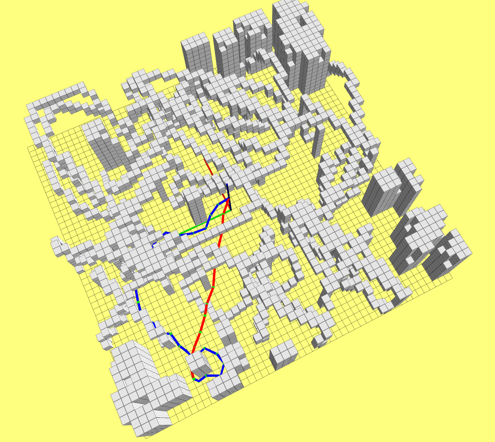

## 1.依赖库

`ompl`: sudo apt-get install libompl-dev

## 2.编译和运行

```shell
cd {workspace}/motion_planning/lecture_3_sample_based_path_finding
catkin_make
source devel/setup.bash

# 运行基于ompl库的RRT star路径搜索算法
roslaunch grid_path_searcher demo.launch

# 运行自己实现的RRT和RRT star
roslaunch grid_path_searcher compare_demo.launch
```

## 3.实验结果

**基于ompl库的RRT star路径搜索算法**


使用了开源路径搜索库ompl中的RRT star算法，发现它总是能以稳定的时间搜索出一个比较优异的路径。在使用的地图只有10mX10mX2m的情况下，搜索一条路径大约需要1s，即使将地图扩大到50mX50mX50m，搜索时间依然稳定在1s。我猜测之所以会出现这种现象，主要原因是RRT star使用了贪心的采样方法，可以迅速搜索出一条路径，然后再进行轨迹优化，将总时间控制在1s左右，找到路径的时间越短，那么留给优化的时间就越长。

**自己实现的RRT和RRT star路径搜索算法**



为了更加深入的理解RRT系列算法，我自己编程实现了`RRT`和`RRT star`算法。在实现过程中，并没有对采样方法进行限制，完全依照随机采样。另外对于路径增长的补偿也设置为固定。实验发现，RRT算法在搜索路径时，其时间完全不可控，有时用时几十毫秒，有时用时超过100秒。而且其搜索出来的路径，多数情况是比较差的，路径离最优路径相差非常之多。

而在对RRT star算法的实验过程中发现，RRT star算法在路径的优异性上比RRT有巨大提升，通常情况下几乎要接近最优路径，但是由于采样的随机性，它的时间也同样不可控，有时很快，有时非常慢。

> 关于RRT star可以进行的改进思路有：①对采样方法进行优化，使得采样具有目的性；②动态规划路径的增长步长，可以在空旷的地方实现较大的跳跃；③ ……

## 4.结论

RRT这种基于采样的方法，原理非常简单，思路也很朴素。在解决路径搜索问题上，显得很笨拙。在将自己实现的RRT和RRT star用于50mX50mX10m的地图时，几乎都不能在10s之内搜索到一条路径。及时用ompl库的RRT star算法其速度也没有JPS或者A star速度快，100mX100mX20m的地图，A star和JPS都能在毫秒级完成搜索。所以暂时没有发现RRT系列算法比A star或者JPS等基于图搜索方法的优异之处。虽然没有发现，但是不代表没有优势，后续的研究中将继续探索基于采样方式的路径搜索算法。

补充：后来我花了一些对RRT和A star做了比较细致的对比，其中也发现了RRT的优势，可以参考我的[博客](https://blog.csdn.net/u011341856/article/details/122002858?spm=1001.2014.3001.5501)
