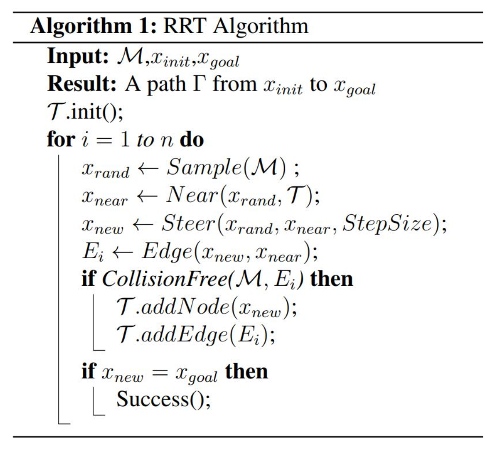

# 总结

## 1. Probabilistic Road Map(PRM)

`PRM`算法可以分为两个阶段：①Learning phase; ②query phase.

**Learning phase**

- step1: 在配置空间中随机采用N个point；
- step2: 删除那些落在障碍物中的点；
- step3: 连接那些距离阈值小于的点对形成线段，删除与障碍物相交的线段。

**Query phase**

- step1: 对learning phase阶段形成的线段执行路径搜索算法，例如A star、Dijkstra。

**PRM的优缺点：**

- 优点：概率完备，一定有解；
- 缺点：规划出来的路径，不一定适合机器人的运动约束；实际上在Learning phase时就已经能够找到一条路径，所以分成了两个阶段，效率不够高。

> PRM在检测点是否在障碍物中，是非常耗费计算资源的。

## 2. Rapidly-exploring Random Tree(RRT)

**RRT**算法的核心是通过不断地采样空间中的点构建一颗路径节点数，然后通过终点回溯找到一条通往起点的路径。RRT算法没有路径搜索的过程，它不会像A star等算法一样去不停地执行搜索过程。由于它是基于随机采样的方法执行搜索操作，所以它大概率情况下找到的路径不是最优的。

**RRT算法的步骤**

- step1：对空间进行随机采样，获得一个节点$x_{rand}$;
- step2：然后找到离$x_{rand}$最近的节点$x_{near}$;
- step3：在$x_{near}$到$x_{rand}$的直线上前进StepSize距离，得到一个新的点$x_{new}$
- step4：连接$x_{near}$和$x_{new}$组成一个新的边$E_i$；
- step5：对$E_i$执行障碍物判断，如果没有障碍物则将$x_{new}$和$E_i$添加到容器中；
- step6：当$x_{new}$​在目标点附近时，搜索过程结束。

> RRT算法的核心函数就是：采样、最近邻搜索、障碍物判断

**RRT的伪代码**

**RRT的优缺点**

- 优点：采样的过程中会目的性的找到一条通往目标点的路径；
- 缺点：不是最优的路径；不高效；采样是在整个空间执行的，目标点处在狭窄空间之中，搜索的速度会下降会快。

**RRT算法的改进**

- 对于$x_{near}$的搜索采用Kdtree；
- 执行双向搜索。当在空间中执行采样时，分别对起点和终点执行RRT搜索过程。但是不是分别对起点和终点执行采样。

## 3. Rapidly-exploring Random Tree Star(RRT*)

RRT*算法的核心思想是：通过不断地的迭代优化之前获得的路径，使得路径往代价最小的方向发展。

**RRT*算法的流程**

- step1：对空间进行随机采样，获得一个节点$x_{rand}$;
- step2：然后找到离$x_{rand}$最近的节点$x_{near}$;
- step3：在$x_{near}$到$x_{rand}$的直线上前进StepSize距离，得到一个新的点$x_{new}$
- step4：如果$x_{new}$不在障碍物上；
  - step41：则对$x_{new}$执行基于半径的近邻搜索，找到距离$x_{new}$一定范围内的所有节点$X_{newr}$；
  - step42：把$X_{near}$中的节点与$x_{near}$连接起来，选择一条从$x_{near}$到达起点代价最小的路线，于是就确定了$x_{near}$的父节点；
  - step43：执行review(重新连接)操作，重新整理节点之间的关系，那些之前父节点指向$x_{near}$之外的节点，此时可能通过$x_{near}$到达起点具有更小的代价，于是就修改它的父节点为$x_{near}$

##　4. RRT star的改进

> 对于RRT*算法的改进主要集中在`Sample()`、`Near()`、`Steer()`等函数上！

**Kinodynamic-RRT* **: 它改进了`Steer()`函数，对于`RRT*`它默认情况下`Steer()`函数生成的是直线路径，但是`Kinodynamic-RRT*`改进之后的`Steer()`可以根据机器人运动约束生成曲线轨迹。

**Anytime-RRT***：该算法可以边走边轨迹轨迹，当机器人达到一个位置时，则以当前位置为起点，依然借用之前形成的Tree进行轨迹规划，可以达到一个动态轨迹规划的效果。

## 5. Advanced Sampleling-based Methods

**Informed RRT***：该算法在路径搜索阶段与RRT*一致。但是在轨迹生成之后，`Informed RRT*`还可以对轨迹进行优化，获得更加优化的轨迹。它的主要思想是以起点和终点为两个支点，然后以RRT*搜索出来的轨迹长度来画椭圆，然后在这个椭圆之内继续撒点，对轨迹进行优化，最后得到更小的椭圆和更优的轨迹。

**Cross-entropy motion planning**：该算法是对采样过程进行优化。它在RRT*算法搜索到轨迹之后，通过采样方法对轨迹进行优化。

## 6.Local Planner和Global Planner

**Global Planner**：规划处一条全局的路线，但是并不是机器人真实可行的路线，因为路上可能会有动态障碍物。

**Local Planner**：根据全局路径的先验，规划一条机器人实际运行的局部路线，包括动态障碍物的规避路线。

