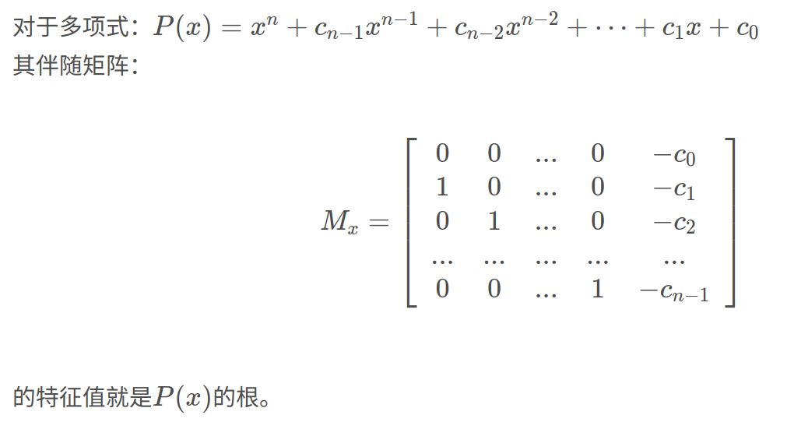
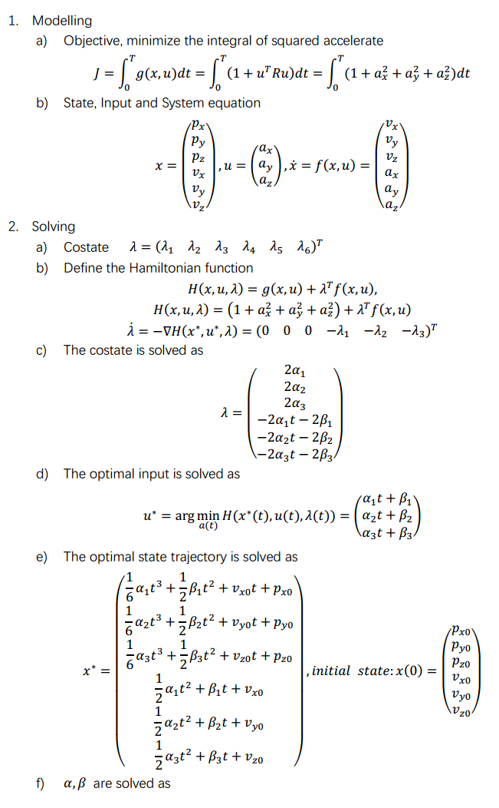
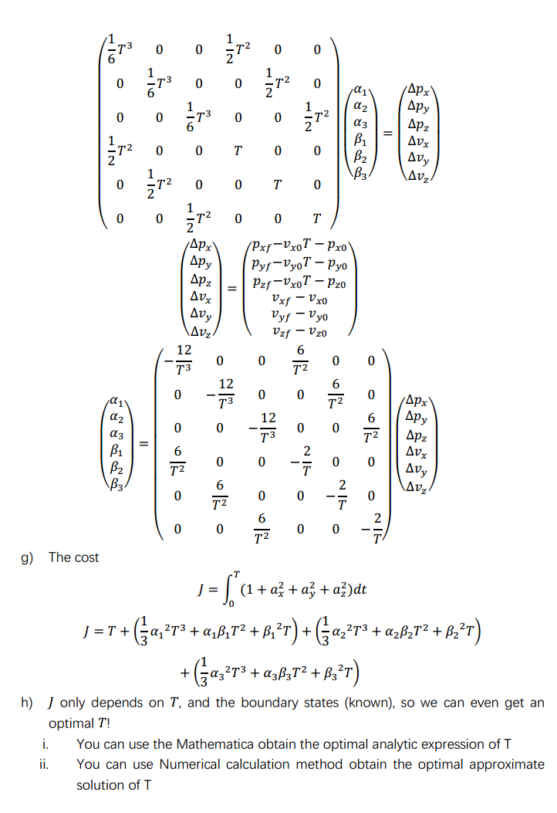
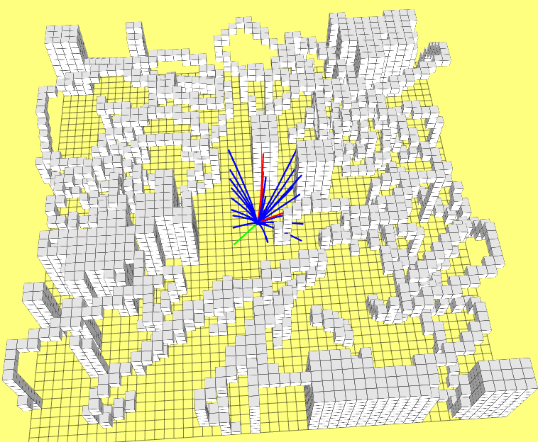
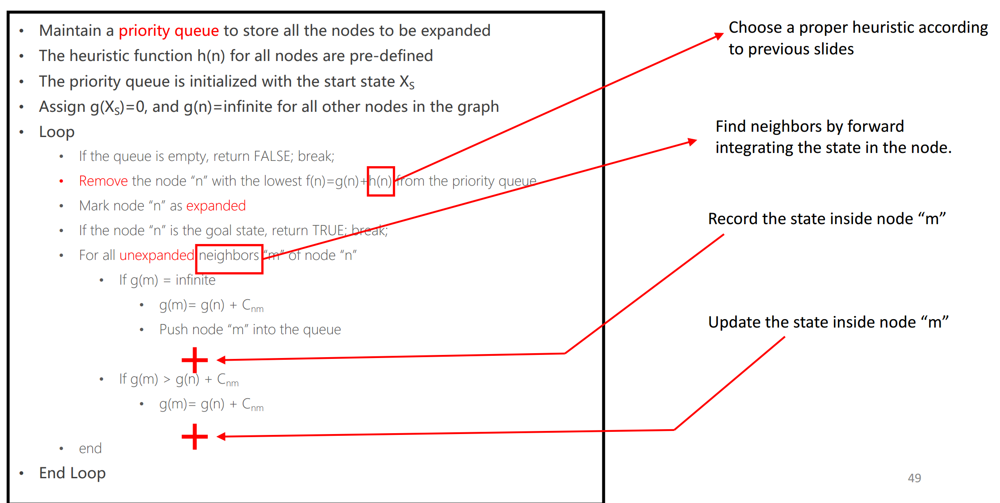
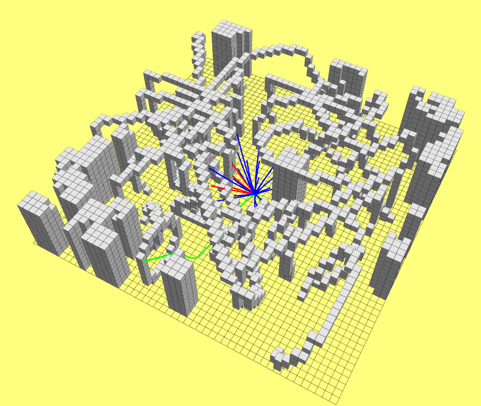
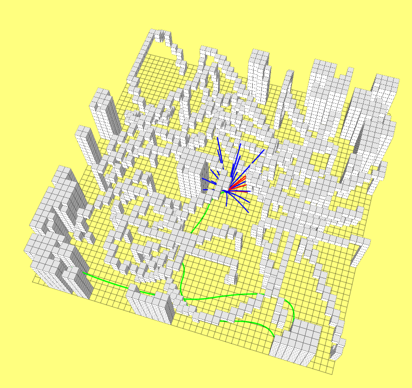

**代码运行方法：**

```shell
cd lecture_4_kinodynamic_path_finding
catkin_make
source devel/setup.bash

roslaunch grid_path_searcher demo.launch
```

## 1. OBVP问题求解

OBVP问题的求解步骤：

- 写出代价函数$J$，确定状态变量和谐态变量
- 然后写出Hamiltonian函数H；
- 根据minimum principle，假设已知$s^*(t), u^*(t)$不同时间的最优量，写出谐态的微分方程；
- 对谐态方程求积分得到谐态的解，由于谐态在求解的时候带入了未知常数，所以想办法求解；
- 将带有未知常数的谐态变量带入H函数，然后根据minimum principle写出$u^*$的方程;
- 如果末状态量有无限制的量，则其满足边界条件，此时通过minimum principle的边界条件，则可以写出其方程，否则直接带入末状态；
- 联立以上写出来的方程就可以求解出$J$.

对于起始状态已知，终止状态中$p$已知，$v,a$任意的运动规划求解如下图：


> 可以参考博客：https://blog.csdn.net/gophae/article/details/107921163

### 1.1 多项式的解析解

对于OBVP问题，需要求解J的最小值。一般思路是对J进行求导，去极值为零的点对应的t。通过运算发现J的导数是关于t的四阶方程，对于一元四阶方程的求根方法可以采用伴随矩阵的方法。



>  去特征值最大的那个t最为最优解，目的是让机器人可以沿着当前控制量尽可能的运动更远。

## 2. OBVP实际应用例子

对于模型的系统(无人机)，给定初始化速度和位置以及末状态的位置和速度，它的OBVP建模和求解过程如下：





当需要完成一层lattice graph搜索时，在控制空间离散不同方向的加速度得到一层lattice graph，然后通过启发函数来判断哪一条采样的轨迹是代价最小的。启发函数的设计是，假设没有障碍，然后执行状态空间搜索，直接判断当前状态到末状态的代价，最小代价即为最优。

**实验结果如下**



上图中设置终点在左下角，然后执行空间空间采样，得到不同加速度下的离散轨迹，对于那些没有障碍物的轨迹，执行OBVP(当前点到目标点)计算，得到代价最小的轨迹。

根据实验结果统计发现，一层lattice graph(27条边)的生层用时在0.4ms左右。

> 红色表示当前轨迹有障碍物，蓝色表示没有障碍物，绿色代价最优的轨迹。

## 3. Hybrid A*

为了更深入的理解控制空间和状态空间，以及学习考虑运动学约束之后的路径规划，我实现了一个简单的Hybrid A star路径搜索算法，实现的目的是为了学习，所以实现的代码中还有很多bug和需要改进的地方,，运行过程中出现bug，或者没有找到轨迹均为正常现象，我懒得花时间去优化代码了，哈哈。

实现的Hybrid Astar算法流程基本沿用了如下思路：



其中：

- g(n)的计算策略非常简单和朴素，就是考虑当前点当初始点的欧氏距离。
- f(n)则是采用的OBVP方法计算，当前状态下到终点位置处的代价(与上述2中所述的过程一致)。
- 对邻居节点的扩展，不再像A star那样找各个方向上的邻居。Hybrid A star通过对当前状态施以不同的加速度，获得很多条运动轨迹，这些轨迹就是作为邻居添加。

**实验结果**





由于实现的比较粗糙，所以效果并不好。上两图中的第二张，很明显规划的路径距离最优路径差很多，但是至少规划的轨迹是平滑的。计算时间也比较长，基本都要超过300ms。

**改进思路**

- 动态调整控制空间下的积分时间。当接近目标点时应该缩小积分时间，原理目标点时，尽量增加积分时间；
- 优化g(n)的计算方法，不应该采用欧式距离方法，而应该采用能量代价函数。

