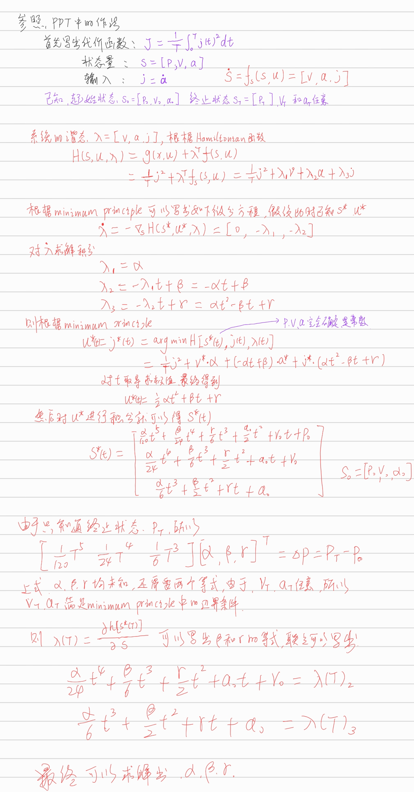

## 1. OBVP问题求解

OBVP问题的求解步骤：

- 写出代价函数$J$，确定状态变量和谐态变量
- 然后写出Hamiltonian函数H；
- 根据minimum principle，假设已知$s^*(t), u^*(t)$不同时间的最优量，写出谐态的微分方程；
- 对谐态方程求积分得到谐态的解，由于谐态在求解的时候带入了未知常数，所以想办法求解；
- 将带有未知常数的谐态变量带入H函数，然后根据minimum principle写出$u^*$的方程;
- 如果末状态量有无限制的量，则其满足边界条件，此时通过minimum principle的边界条件，则可以写出其方程，否则直接带入末状态；
- 联立以上写出来的方程就可以求解出$J$.

对于起始状态已知，终止状态中$p$已知，$v,a$任意的运动规划求解如下图：

