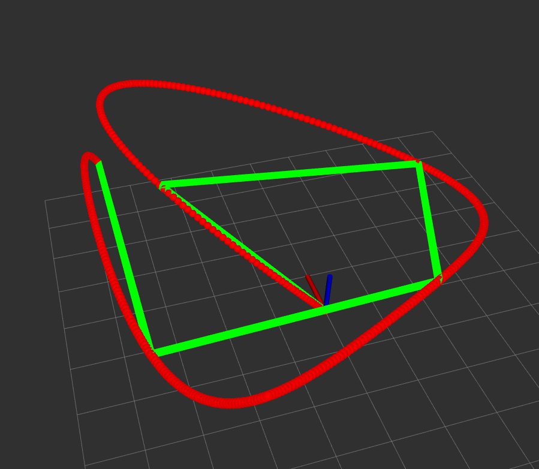
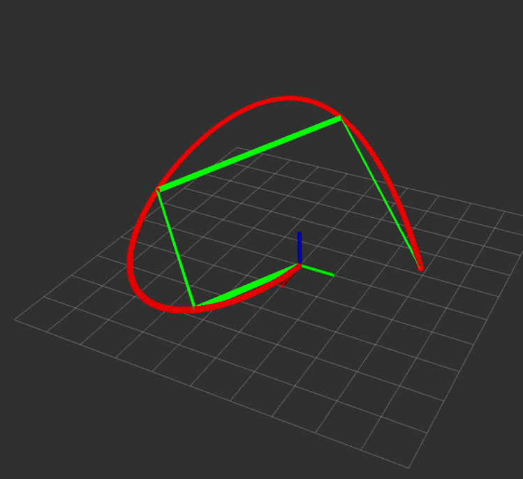
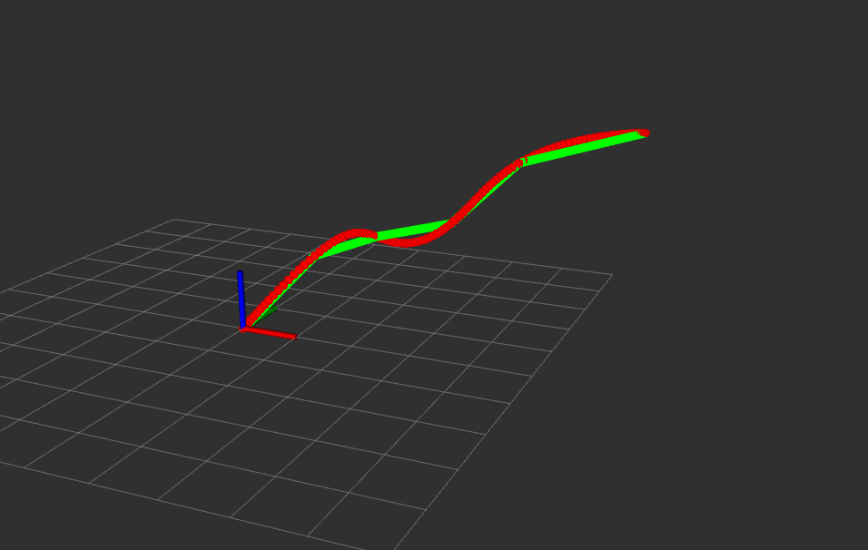
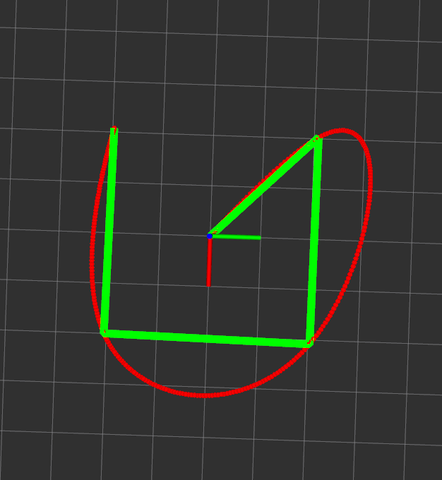
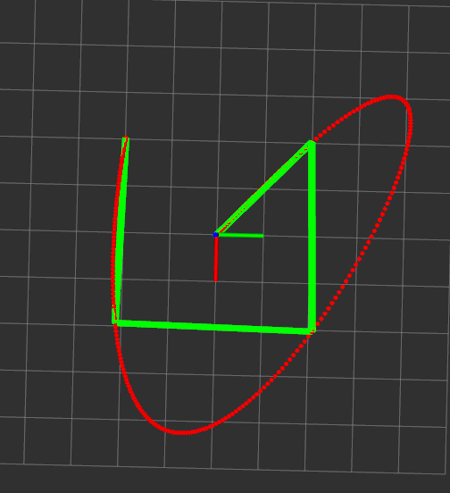
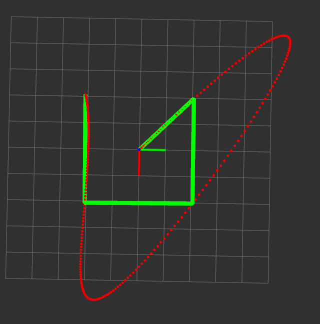
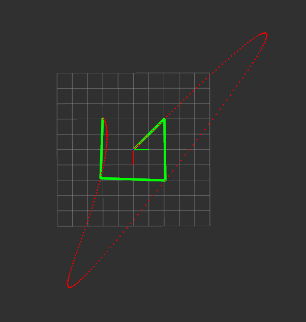

__补充__：由于课程中的公式和推导做了很多省略，对于理解可能会有一些难度，我在博客中对minimum snap做了详细的推导，具体过程可以查看我的[博客内容](https://blog.csdn.net/u011341856/article/details/121861930?spm=1001.2014.3001.5501)

# 实验报告

为了深入理解路径生成，以及QP算法的细节和原理，我实现了两种方法求解QP从而获得多项式的系数。

## 1. 闭式求解QP

对于轨迹生成中的QP问题，实际上它是一个有约束的凸优化问题，而轨迹生成中的约束是一个等式约束，通过一些矩阵运算可以将约束变换到优化函数中，最终变成一个无约束的优化问题。

以下实验均已知起点的位置、速度、加速度，终点位置、速度、加速度和中间点位置。

**起点速度、加速度为0，终点速度不为0**

> 用时: 0.681730 (ms)

**起点和终点速度、加速度均为0**

> 用时: 0.577757 (ms)

**总结**

通过实验发现，对于常规的轨迹生成而言，一般很难指定中间点的运动状态，只有中间点的位置，这样就会带来一个问题，也就是假设机器人在运动的过程中是无法倒退运行，所以对于一些机器人可以自由运动的情况来说，这种轨迹生成方法很难适应，例如倒车的应用场景下。

另外轨迹生成时，每个航点之间生成的轨迹是不完全可控的，所以当运动激烈时，很可能轨迹就进入障碍物上了。如果加入障碍物约束，那么问题的难度又提升了，所以在问题推广性上欠优。

基于QP的轨迹生成方法与控制空间的搜索方法(如Hybrid A*)相比，它在适应性上弱一些，对于复杂环境，控制空间能直接搜索一条可行的路径，该路径机器人可以前进倒退。

但是基于QP的路径生成方法对于每一个航点之间变化不剧烈的情况时，生成的路径是比较优异的。

另外还分别对同一航迹分别取代价函数为2阶、3阶、4阶、5阶导数，它们的轨迹拟合下过如下：

|                    **二阶(最小化加速度)**                    |                     **三阶(最小化jerk)**                     |
| :----------------------------------------------------------: | :----------------------------------------------------------: |
|  |  |
|                     四阶(最小化snap)****                     |                     **五阶(最小化snap)**                     |
|  |  |

## 2. 优化求解

TODO

