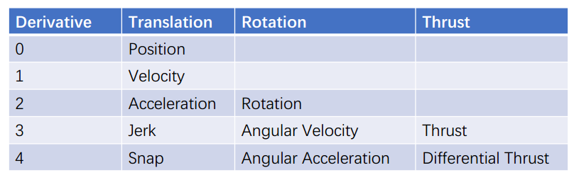
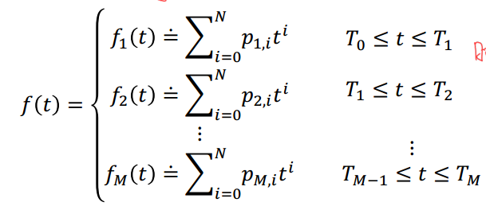
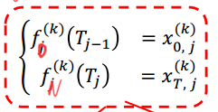
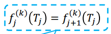

# 总结

## 1. Introduction

前几节的内容已经探索了路径的搜索问题，包括低维空间只考虑位置的搜索，以及考虑动力学的路径搜索。

为什么还需要smooth trajectory呢？虽然考虑下了动力学约束的轨迹搜索可以得到平滑的轨迹，但是有时它并不是最高效的。因此还需要在前述基于轨迹搜索的基础之上，对搜索出来的轨迹进行再生成或者优化。其中轨迹生成/优化被称为后端，轨迹搜索称为前端。

前端和后端的组合：

- kinodynamic + back-end
- path finding + back-end
- only kinodynamic

**轨迹生成/优化**

在轨迹生成或者优化的时候，需要考虑起始点的位姿，以及路径中间的一些关键性waypoint的位姿。轨迹平滑的准则是**通常转化为最小化“input”的变化率**

## 2. Minimum Snap Optimization

### 2.1 Differential Flatness(微分平坦)

对于一个机器人系统，它的状态和控制可以量有很多。但是当该机器人系统有特定形式之后，这些状态量或者控制量，将可以使用状态量或者控制量中的某一个或者几个表示。

对于无人机系统，它的状态量有$[x,y,z,\phi, \theta, \psi,\dot x, \dot y, \dot z, \omega_x, \omega_y, \omega_z]$，其中$\omega$在body frame下。

通过一些集合关系的推导发现，以上状态量只需要$[x,y,z,\psi]$这个四个量的组合完全表示。这意味着如果$[x,y,z,\psi]$这四个状态量能够确定，那么无人机的其余状态量将都能确定。

> 注意：$[x,y,z,\psi]$是连续时间状态下的，如果只是空间中一个孤立的$[x,y,z,\psi]$将无法确定其余状态量。

因此，对于四旋翼无人机系统，它的轨迹控制只需要关注四个状态量，当连续控制$x,y,z,\psi$时，无人机的所有位姿都将被限制。

### 2.2 Minimum-snap

在Minimum Snap Optimization问题中，对于Flat outputs的变量的控制，可以采用多项式拟合轨迹的方法。通过多项式拟合轨迹，可以得到多阶平滑的多项式，而且很容易求到闭式解，另外对于每一个变量可以解耦的进行拟合，独立计算。

在lecture 4中探索了BVP问题的求解，给定两个边界条件，然后通过高阶多项式拟合一条曲线，满足边界条件。但是该方法有很大的局限性，如果直接拟合 起点到终点的轨迹，那么无法控制轨迹中的中间点，如果分段拟合则需要对每一段给定确定的边界条件，这一点在规划问题中很难提前给定。因此就必须考虑使用一种更加通用的方法来解决这个问题。

对于这种多项式拟合问题，需要给定代价函数。

> 因为无人机的加速度和无人机的姿态是绑定的，所以最小化加速度等于最小化旋转。

常用的代价函数为：**最小化jerk/最小化角速度**或者**最小化snap/最小化油门**

> 最小化jerk无人机会沿着旋转较少的路线运动，适合做视觉跟踪；
>
> 最小化snap无人机选择能量最小的路线运动，适合保存能量。

对于一段较长的轨迹规划，可以拆分为多个小的轨迹段，分别用多项式拟合这些轨迹，它们次数都是一致，这样可以简化问题。因此将轨迹建模如下：

> 其中每一段的T必须是已知的！

有了上面所述的多项式建模公式，还需要考虑边界条件：

首先考虑边界点和中间点的微分约束(每个点的速度或者加速度等约束)：

> 其中k表示k阶导数，

然后是连续性约束，由于轨迹的中间点状态两边需要连续，比如说速度要连续，加速度要连续等等。

对于多项式的次数选择，最小化jerk时选择N=5，最小化snap时选择N=7.

对于每段时间T，在工程上为了保证数值的稳定性，多数都是使用相对时间，每一段轨迹的起始时间都是相对于0开始的，不然可以想象一下$T^5$可能就出现溢出等问题。

**多项式的代价函数**

对于一个多项式：
$$
f(t) = \sum_i p_i t^i  \tag{1}
$$
当对其snap最小化时，可以对（1）式求4次导数，然后求解最小二乘解。参看：PPT p33

将最小二乘问题写成二次型矩阵：
$$
J_j(T) = p_j^TQ_jp_j \tag{2}
$$
多项式拟合的目的就是最小化(2)式。

**约束**

由于轨迹拟合问题中是存在约束的，并不是无约束优化问题，所以接下来探讨约束问题。

首先考虑微分约束(包含0阶微分约束，对位置约束)，那么对于微分的约束，最终可以写成如下形式(具体推导过程参看PPT p34)：
$$
A_jp_j = d_j \tag{3}
$$
对于中间点的约束，并不限制其速度和加速度，但是需要保证速度和加速度等状态连续，那些则可以写出如下约束：
$$
f_j^{(k)}(T_j) = f_{j+1}^{(k)}(T_j) \tag{4}
$$
对于（4）式具体形式为：
$$
\sum_{i \ge k} \frac{i!}{(i-k)!}T_j^{i-k}p_{j,i} - \sum_{l \ge k} \frac{l!}{(l-k)!}T_j^{i-k}p_{j+1,l} =0 \tag{5}
$$
将其写成矩阵的形式：
$$
[A_j, -A_{j+1}] [p_j, p_{j+1}]^T = 0 \tag{6}
$$
将以上带约束优化问题，整理如下：
$$
\min \left[ \begin{matrix} p_1 \\  \vdots \\ p_M  \end{matrix} \right]^T 
\left[ \begin{matrix} Q_1 & 0 & 0 \\  0 & \ddots  & 0\\ 0 & 0 & Q_M \end{matrix} \right]
\left[ \begin{matrix} p_1 \\  \vdots \\ p_M  \end{matrix} \right]
 \\
 s.t. A_{eq }\left[ \begin{matrix} p_1 \\  \vdots \\ p_M  \end{matrix} \right] = d_{eq}   \tag{7}
$$
对于（7）式的优化问题是一个带约束的凸优化，待优化的变量是$p$，关于它的求解已经有非常详细的教材介绍。

> 凸优化参考：Courtesy: Convex Optimization, Daniel Palomar, HKUST

另外以上过程的详细论述，可以**参考论文**：Minimum Snap Trajectory Generation and Control for Quadrotors, Daniel Mellinger and Vijay Kumar

### 2.3 凸优化

对于凸函数，其必定可以找到全局最优解。

对于严格的凸优化问题，已有几种常见的通式，例如LP、QP、QCQP、SOCP，上述的minimum snap问题是属于QP通式。

### 2.4 Closed-form Solution to Minimum Snap

对于2.2节中所述的优化问题，它存在一些不稳定性。2.2节所述的优化问题是对多项式的系数进行优化，多项式的系数是无量纲的，所以其大小不会是一个合理的数，当其乘以$t^N$时，可能会出现数值发散。

可以想象，在路径生成的问题中，已知起始、终止点的位置和状态，以及中间点的位置，我们的目的是优化得到中间点的速度和加速度等信息，当求出中间点的速度和加速度之后，再通过映射矩阵得到$p$.

首先，对$p_j$找到一个映射矩阵使得$M_j p_j = d_j$，则对于（7）式可以得到如下形式(M的形式参看PPT p45)：
$$
\min \left[ \begin{matrix} d_1 \\  \vdots \\ d_M  \end{matrix} \right]^T 
\left[ \begin{matrix} M_1 & 0 & 0 \\  0 & \ddots  & 0\\ 0 & 0 & M_M \end{matrix} \right]^{-T}
\left[ \begin{matrix} Q_1 & 0 & 0 \\  0 & \ddots  & 0\\ 0 & 0 & Q_M \end{matrix} \right]
\left[ \begin{matrix} M_1 & 0 & 0 \\  0 & \ddots  & 0\\ 0 & 0 & M_M \end{matrix} \right]
\left[ \begin{matrix} d_1 \\  \vdots \\ d_M  \end{matrix} \right] \tag{8}
$$
很明显，（8）式中有一些$d$是固定的，比方说起始和终止点的状态都是已知的，中间点的位置是已知，所以这些$d$实际上是常数，并不需要进行优化。可以通过一个选择矩阵$C$来分离$d$为free($d_P$)和fixed($d_F$).

将$d$通过$C$分解之后，得到$J$如下：
$$
J =
\left[ \begin{matrix} d_F \\ d_P \end{matrix} \right]^T CM^{-T}QM^{-1}C^T
\left[ \begin{matrix} d_F \\ d_P \end{matrix} \right] \\
= \left[ \begin{matrix} d_F \\ d_P \end{matrix} \right]^T
\left[ \begin{matrix} R_{FF} & R_{FP} \\ R_{PF} & R_{PP} \end{matrix} \right]
\left[ \begin{matrix} d_F \\ d_P \end{matrix} \right] \tag{9}
$$ { }
经过以上转换之后，对于边界条件和中间点条件都转换到(9)式内部了，此时的优化问题就变成了无约束优化了。则，$d$的最优解如下：
$$
d_P^* = -R_{PP}^{-1}R_{FP}^Td_F \tag{10}
$$
通过$M_j p_j = d_j$就可以解出多项式的系数了。

还有一个问题，那就是矩阵$C$如何确定？通过PPT p47可以发现，$C$是通过拼凑的方式得到的一个固定的矩阵。

至此关于多项式的闭式解和优化解均已给出。

> PPT中给出的闭式解推导过程比较简单，我尝试还原了其中一些推导细节，参考文档《minimum_snap推导》

剩下一些关于工程相关的细节问题，直接参看PPT。

